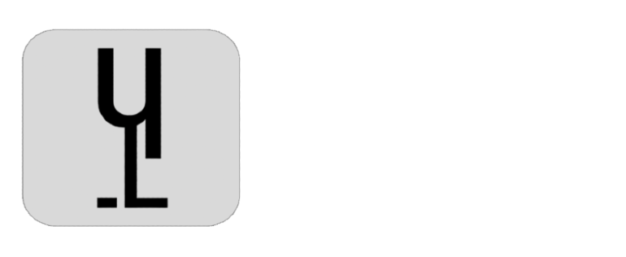

<div align="center">



_Luth is a high-level, flexibly-typed, interpreted programming language._

</div>

## 📖 About

_Luth_ is a **multi-paradigm**, **concurrent**, **fast**, **interpreted**, **flexibly-typed** and **easy-to-use** programming language that provides **_flexibility_** in all kinds of uses and projects.

It was created as an alternative to existing **high-level** languages, containing all the **modern** and **advanced** features needed in today's world.

## 📚 Documentation
For the moment and while the web page is being developed, all the documentation is in the [docs folder](/docs).

## 👀 Examples

<details>
<summary>🌏 Hello world</summary>

```ts
print("Hello world!");
```

</details>

<details>
<summary>➕ Add numbers</summary>

> Static typing

```go
func add_numbers(a: Int, b: Int): Int {
  return a + b;
}

var result: Int = add_numbers(5, 3);
print("Result of adding 5 and 3: {result}");
```

> Dynamic typing

```go
func add_numbers(a, b) {
  return a + b;
}

var result = add_numbers(5, 3);
print("Result of adding 5 and 3: {result}");
```

</details>

<details>
<summary>🌸 Fibonacci</summary>

```go
func fibo(n: Int) {
  if n <= 1 {
    return n;
  } else {
    return fibo(n - 1) + fibo(n - 2);
  }
}

var num = 10;
var result = fibo(num);
print("Recursive Fibonacci of {num}: {result}");

```

</details>

<details>
<summary>📡 Concurrency</summary>

```nim
var chan = thread_ch();
var sync = thread_sync(2);

thread {
    print("Hello from thread 1!");

    chan.send("data");
    sync.ready();
}

thread {
    print("Hello from thread 2!");

    var data = chan.receive();
    print(data);

    sync.ready();
}

sync.wait();
```

</details>

<hr/>

_For more examples, see the [examples folder](docs/examples/)._

## 📄 License

[BSD 3-Clause](./LICENSE)

## 🙋🏼‍♂️ Author

**Nehuén/Neth** - [Github](https://github.com/nehu3n)
